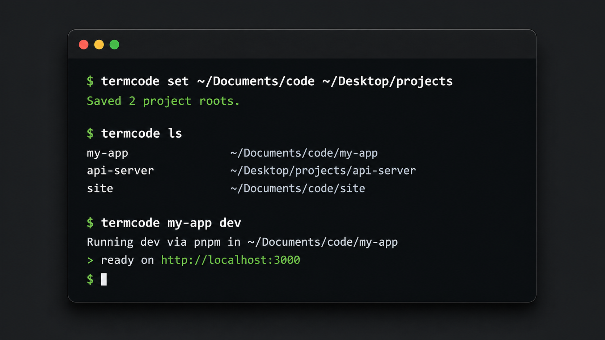

# jumpdir

`jumpdir` is a small macOS CLI for finding local repos, opening them, and running package scripts without remembering where every repo lives.



## Why jumpdir?

AI has changed how I work on code. I spend less time manually navigating an editor and more time running local projects from a multi-tabbed terminal.

`jumpdir` exists so I do not have to remember where every repo lives. Configure your project folders once, then list repos, open them, or run package scripts by name.

## Usage

```sh
jumpdir
jumpdir runner set pnpm
jumpdir set ~/Documents/code ~/Desktop/projects
jumpdir ls
jumpdir update
jumpdir my-app
jumpdir my-app '?'
jumpdir my-app help
jumpdir cd my-app
jumpdir my-app dev
jumpdir my-app dev-2
jumpdir my-app run dev
jumpdir my-app bun run dev
jumpdir my-app bun install
jumpdir open my-app
jumpdir . my-app
jumpdir rename my-long-repo-name my-app
```

`jumpdir set` saves the roots to `${JUMPDIR_CONFIG_DIR:-${XDG_CONFIG_HOME:-$HOME/.config}/jumpdir}/roots`.
Aliases created by `jumpdir rename` are saved to `aliases` in the same directory, your preferred runner is saved to `runner`, and the daily update check date is saved to `update-check`.

## Termcode Compatibility

`termcode` remains available as a compatibility command. The installer adds both `jumpdir` and `termcode`, and existing `TERMCODE_*` environment variables still work as fallbacks for the new `JUMPDIR_*` names.

If you already have `~/.config/termcode` and no `~/.config/jumpdir`, `jumpdir` will keep using the existing config so your roots, aliases, and runner preference continue to work.

## First Run

Run `jumpdir` with no arguments to start onboarding:

```text
Welcome to jumpdir.

Step 1: Choose your preferred runner
  1. bun run
  2. pnpm run
  3. npm run
  4. yarn run
  5. none

Step 2: Add project directories
  Example: ~/Documents/code ~/Desktop/projects
```

After each directory step, `jumpdir` lists the projects it found and lets you add another directory or proceed.

## Preferred Runner

The preferred runner is the package runner `jumpdir` uses when you run a script by name:

```sh
jumpdir runner set pnpm
jumpdir my-app dev
jumpdir my-app run dev
```

Both script forms run:

```sh
pnpm run dev
```

To clear it:

```sh
jumpdir runner clear
```

If no preferred runner is set, provide one in the command:

```sh
jumpdir my-app bun run dev
jumpdir my-app pnpm run dev
jumpdir my-app npm run dev
jumpdir my-app yarn run dev
```

You can also run package-manager commands inside a project:

```sh
jumpdir my-app bun install
jumpdir my-app pnpm add react
```

If you type a script name that is not in the project `package.json`, `jumpdir` prints the available script names for that project before exiting. When you run only `jumpdir my-app` in an interactive terminal, it still prints the project path and also shows the scripts you can run next.
Run `jumpdir my-app '?'` or `jumpdir my-app help` to show the project path, jump/open commands, available package scripts, and package-manager command examples.

## Jump Workflow

Without shell integration, `jumpdir <project>` prints the project path:

```sh
jumpdir my-app
jumpdir cd my-app
jumpdir path my-app
```

To make `jumpdir my-app` or `jumpdir cd my-app` change your current shell directory in zsh, add this to your shell config:

```sh
eval "$(jumpdir init zsh)"
```

A standalone CLI cannot change its parent shell directory, so the shell integration wraps the binary and runs `cd "$(command jumpdir path my-app)"` for one-argument project jumps.
The same zsh integration also enables tab completion for project names, aliases, and package scripts.

## Install

```sh
curl -fsSL https://raw.githubusercontent.com/ishaqyusuf/jumpdir/main/install.sh | bash
```

By default, the installer puts `jumpdir` at:

```sh
~/.local/bin/jumpdir
```

To choose another install location:

```sh
curl -fsSL https://raw.githubusercontent.com/ishaqyusuf/jumpdir/main/install.sh | sudo env JUMPDIR_INSTALL_DIR=/usr/local/bin bash
```

Use `sudo` only for system-owned directories like `/usr/local/bin`.

## Update

Check whether a newer version is available:

```sh
jumpdir update
```

When used in an interactive terminal, `jumpdir` checks for updates at most once per day. If a newer version is available, it asks whether to update now. Choosing `n` continues with the command you already typed.

Rerun the installer to update `jumpdir`. It overwrites the existing binary with the latest version from `main`.

```sh
curl -fsSL https://raw.githubusercontent.com/ishaqyusuf/jumpdir/main/install.sh | bash
```

If you installed to `/usr/local/bin`, update with the same install directory:

```sh
curl -fsSL https://raw.githubusercontent.com/ishaqyusuf/jumpdir/main/install.sh | sudo env JUMPDIR_INSTALL_DIR=/usr/local/bin bash
```

## Install From Source

```sh
git clone https://github.com/ishaqyusuf/jumpdir.git
cd jumpdir
./install.sh
```

To install from a local clone into another directory:

```sh
JUMPDIR_INSTALL_DIR=/usr/local/bin ./install.sh
```

To install from another branch or tag with curl:

```sh
curl -fsSL https://raw.githubusercontent.com/ishaqyusuf/jumpdir/main/install.sh | JUMPDIR_REF=v0.3.0 bash
```

For forks, pass `JUMPDIR_REPO_OWNER` and `JUMPDIR_REPO_NAME` to the `bash` command.

## Homebrew Preparation

A formula template lives at `packaging/homebrew/jumpdir.rb.template`.
After tagging a release, replace the placeholder repository URL and checksum, then publish it through a tap.

## Project Discovery Rule

Discovery is intentionally simple:

- search only the roots configured with `jumpdir set`
- include only direct child folders
- include only folders containing `package.json`
- list callable names alphabetically
- report duplicate callable names instead of guessing

## Commands

```sh
jumpdir set <paths...>
jumpdir ls
jumpdir runner get
jumpdir runner set <bun|pnpm|npm|yarn|none>
jumpdir runner clear
jumpdir update
jumpdir rename <current-name-or-path> <new-alias>
jumpdir path <project>
jumpdir cd <project>
jumpdir init zsh
jumpdir open <project>
jumpdir . <project>
jumpdir <project> ?|help
jumpdir <project> <script> [args...]
jumpdir <project> run <script> [args...]
jumpdir <project> <runner> run <script> [args...]
jumpdir <project> <runner> <command> [args...]
```

Script execution uses your preferred runner, `run` as the second word uses your preferred runner explicitly, and a named runner can execute package-manager commands inside the project.
Invalid script names fail before invoking the runner and show the scripts from that project's `package.json`.

## Development

```sh
./bin/jumpdir --help
./bin/jumpdir --version
bash tests/run.sh
```

See `brain/PROJECT_INDEX.md` and `brain/tasks/backlog.md` for future work.
